# 欧卡2渲染分析

因为RenderDoc和NSight都无法启动欧卡2，以下全靠猜。

## 场景部分

### 植被相关

欧卡2的植被效果如图所示：
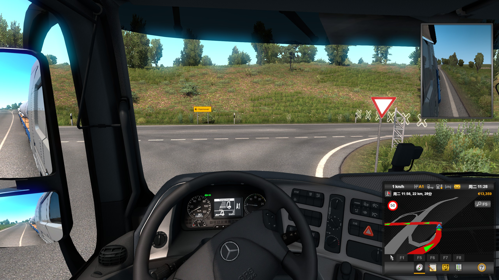
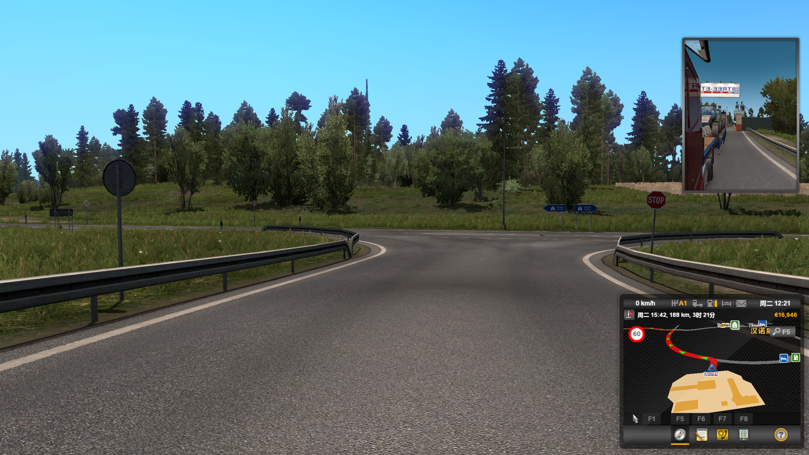
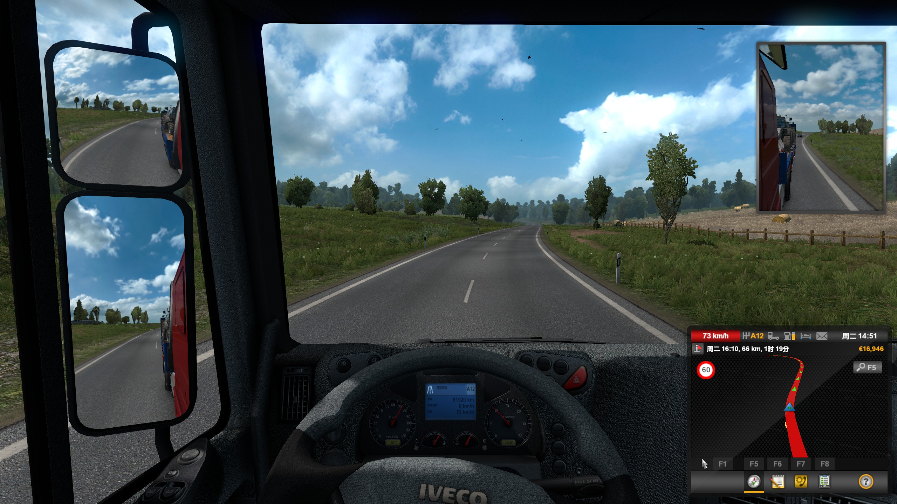
主要由以下部分组成：

* 完全无阴影无AO的草
* 带AO的灌木
* 带LoD和完全阴影的树木

这三种物体都有随着时间摇动的VS效果

树木的LoD分级距离比较小，大约200m就化为billboard，并且不同的树木culling距离不同

### 地形与静态建筑

道路路面贴图很细，并且有一层来模拟轮胎的效果。地形与静态建筑有明显的LoD，并且根据不同类型设置了不同的加载距离。对于一些比较细但是不重要的模型，甚至没有阴影，如路肩的台阶：
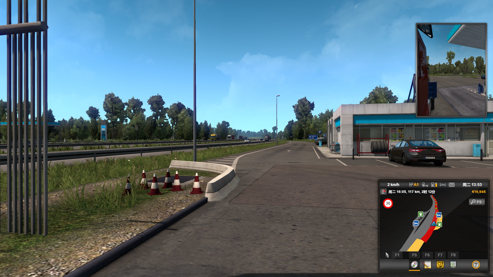

对于桥梁等建筑，基本都使用了同样的一套模型与贴图，最大限度重复使用资源：
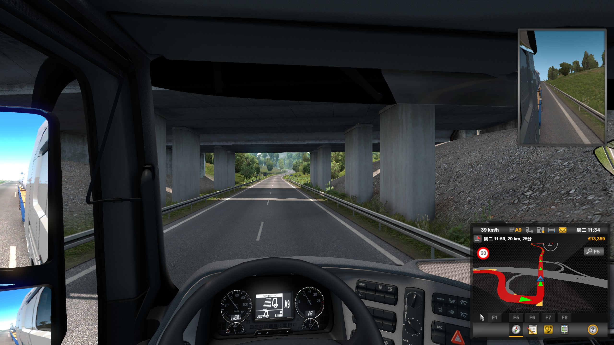

栏杆的面数很低，而且曲线离散化的步长很长，甚至没有法向贴图来做平滑：
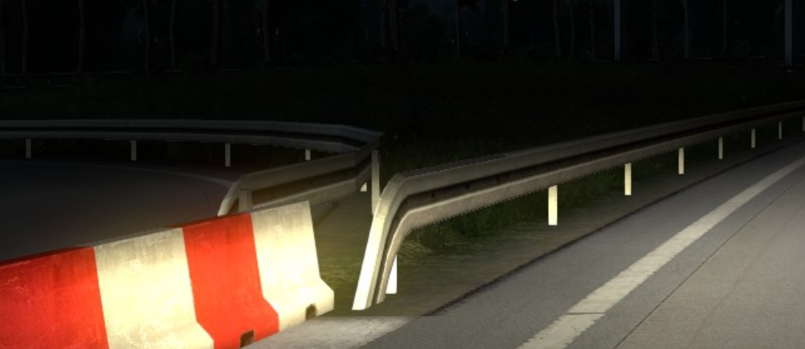

## 光照部分

白天和晚上使用同一套AO，光影使用实时动态光，下图可见明显的阴影贴图分辨率不足的锯齿：
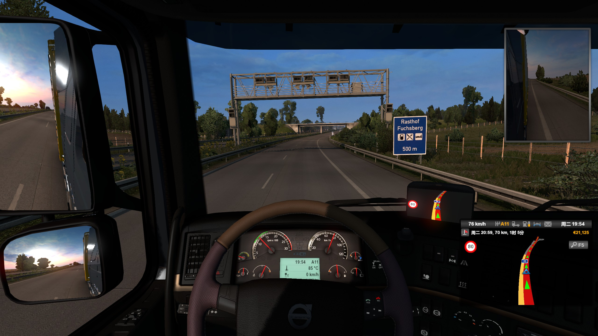

游戏极大的限制了阴影贴图绘制距离，大约5m内为一级，5m~100m为第二级，100~200m为第三级，再远就没有阴影，只有AO
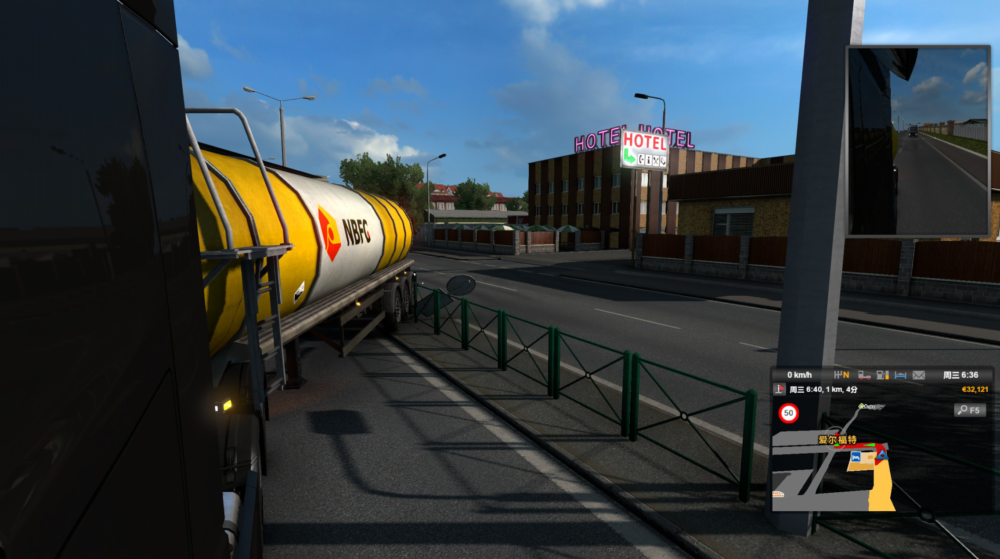

不同于日照，游戏内的其它灯光均不产生阴影，降低了资源消耗，这也导致在夜里场景里完全没有阴影，只有模型AO的效果：
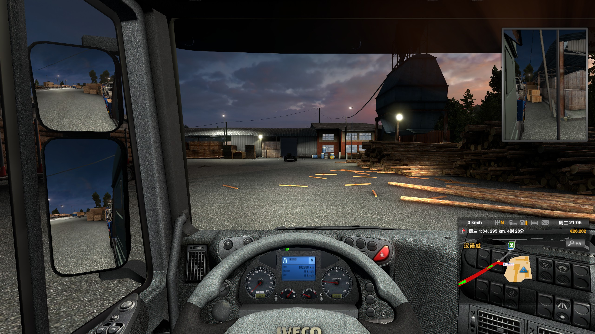

运动的车辆应该是使用SH来实时计算的AO：
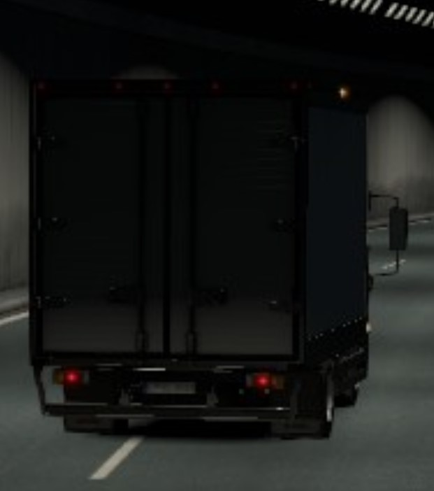

## 后处理

太阳的体积光：
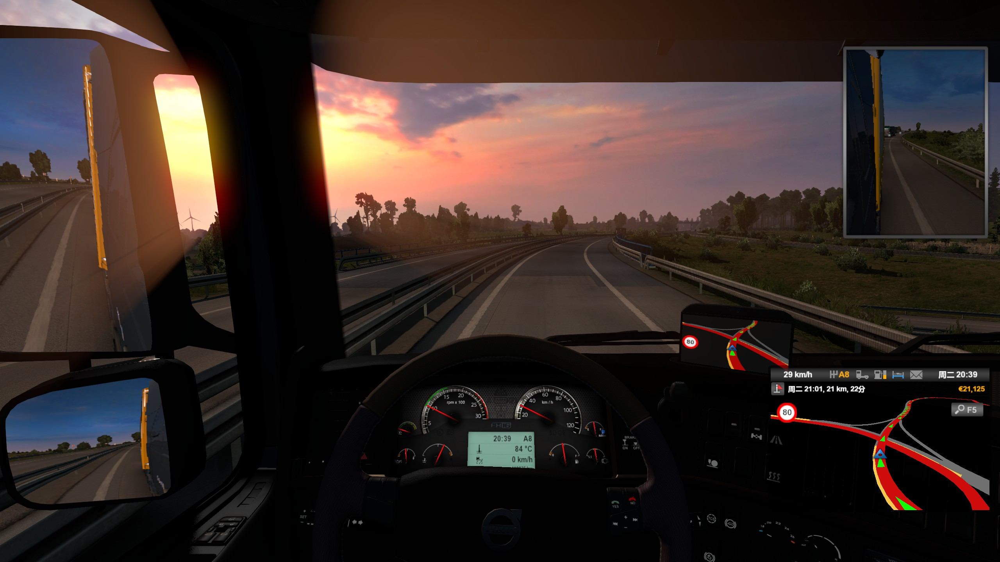

雾天的体积雾与车窗上的雨滴效果：
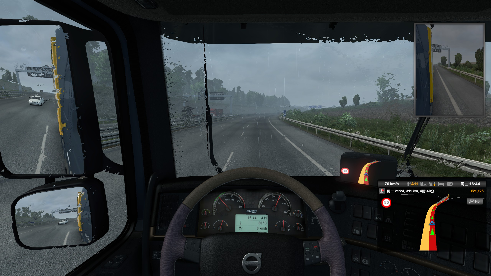